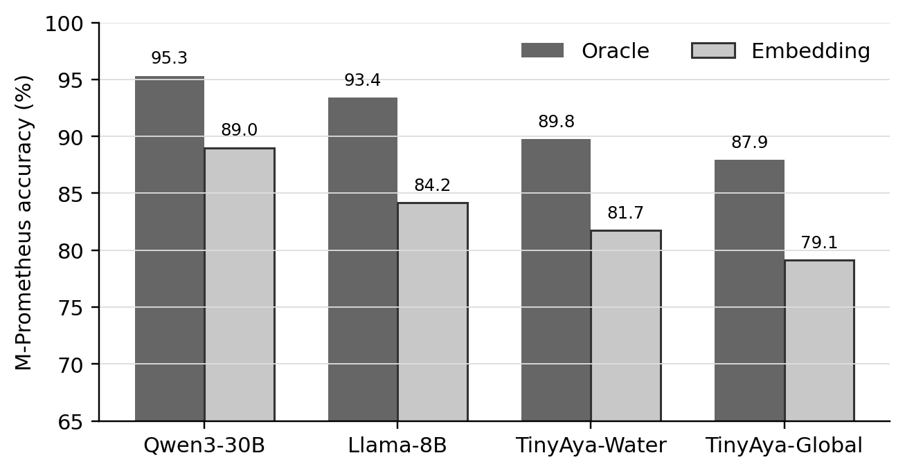
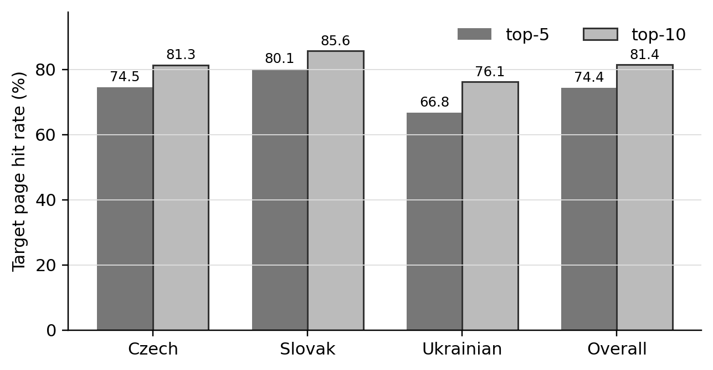
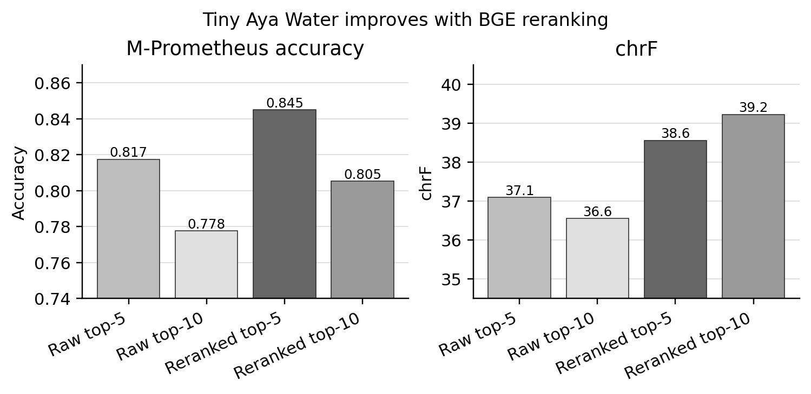

# Minding the Retrieval Gap in AI Question Answering

**Oracle vs. Embedding RAG for Multilingual Regional QA on CUS-QA**

## Project Overview

This project was developed for the RAG track in **IN5550: Neural Methods in
Natural Language Processing** at the University of Oslo. The goal of the exam
was to write and submit a “mini master thesis” style paper in NLP, supported by
an implemented experimental system. The accompanying paper, **“Minding the
Retrieval Gap in RAG: An Oracle vs. Embedding RAG Analysis on Multilingual
Regional QA,”** was selected as the **top paper for the RAG track out
of 6 submitted papers**.

Quick links:

- [Full report PDF](Minding_the_Retrieval_Gap_in_RAG__An_Oracle_vs__Embedding_RAG_Analysis_on_Multilingual_Regional_QA.pdf)
- [Outstanding paper award](top_paper_for_the_rag_track.JPG)
- [2-minute presentation](2min_presentation_rqa_minding_the_retrieval_gap_in_rag.pdf)

Paper abstract:

Open-ended regional question answering asks for locally grounded facts, such as
the garden associated with a Czech town or the genre of a Slovak music
association, that broad multilingual benchmarks fail to capture and current
large language models (LLMs) struggle to answer. I study how
retrieval-augmented generation (RAG) can close this gap on CUS-QA, a dataset of
native-speaker questions in Czech, Slovak, and Ukrainian. To separate retrieval
from generation errors, I compare Oracle RAG, fed the known source page, against
Embedding RAG, which retrieves same-language chunks via a dense multilingual
embedding model. I evaluate four open-weight generators, `Tiny Aya Global
(3.35B)`, `Tiny Aya Water (3.35B)`, `Llama 3.1 8B`, and `Qwen3-30B-A3B`, with
LLM-as-a-judge M-Prometheus and chrF on the hidden test. Retrieval is the
dominant bottleneck: replacing known source-page context with realistically
retrieved chunks drops answer correctness from `0.953` to `0.890` even for the
strongest model. `Qwen3-30B-A3B` delivers the best practical performance, and a
top-`k` ablation shows that larger models benefit from more retrieved context
while smaller Tiny Aya models are distracted by it. The repository also
includes a focused BGE reranking pilot showing that cleaner evidence ordering
improves Tiny Aya Water.

What this repository contains:

- End-to-end Oracle and Embedding RAG pipeline code.
- SLURM workflows for Fox, the UiO HPC cluster.
- Retrieval diagnostics, M-Prometheus judging, and Codabench packaging.
- Small smoke data, manual-audit CSVs, cleaned result tables, and selected
  plots.
- An optional BGE reranking pilot over E5 retrieval.

The rest of this README documents the main findings, tracked artifacts, and
commands for reproducing the RAG pipeline. Large generated outputs, cached
models, FineWiki indexes, and local report-drafting artifacts are intentionally
excluded and can be regenerated under `$CUSQA_WORK`.

## Headline Results

The reported experiments cover native-language text questions only. Development
answer quality uses M-Prometheus binary correctness as the primary metric;
Codabench hidden-test comparisons use chrF for partial native-text submissions.

- Target-title retrieval improves from `74.4%` at top-5 to `81.4%` at
  top-10 on the 1,408-question development set.
- Direct retrieval diagnostics show that top-10 improves gold-page recall
  from `0.7436` to `0.8139`, while MRR changes only from `0.5867` to `0.5962`;
  strict answer-string recall rises from `0.6357` to `0.6690`, and relaxed
  answer-token recall rises from `0.7820` to `0.8281`.
- The strongest generator still shows an Oracle-to-Embedding gap: Qwen3-30B
  reaches `0.953` M-Prometheus accuracy with known-source chunked Oracle
  context and `0.890` with E5 top-10 retrieved FineWiki context.
- Top-10 retrieval helps Qwen3-30B and Llama-8B, but hurts both Tiny Aya
  variants, so retrieval depth should be tuned with the generator.
- A focused BGE reranking pilot improves Tiny Aya Water in both final context
  sizes, but reranked top-5 remains best for this small generator.
- The strongest partial Codabench submission is E5 top-10 plus Qwen3-30B with
  `51.09` weighted native-text chrF.

### Development M-Prometheus

| System | Condition | `k` | Accuracy | Correct |
|---|---|---:|---:|---:|
| Oracle Qwen3-30B | Oracle | -- | 0.9531 | 1342 / 1408 |
| Oracle Llama-8B | Oracle | -- | 0.9339 | 1315 / 1408 |
| Oracle TinyAya-Water | Oracle | -- | 0.8977 | 1264 / 1408 |
| Qwen3-30B top-10 | Embedding | 10 | 0.8899 | 1253 / 1408 |
| Oracle TinyAya-Global | Oracle | -- | 0.8793 | 1238 / 1408 |
| Qwen3-30B top-5 | Embedding | 5 | 0.8700 | 1225 / 1408 |
| Llama-8B top-10 | Embedding | 10 | 0.8416 | 1185 / 1408 |
| Llama-8B top-5 | Embedding | 5 | 0.8295 | 1168 / 1408 |
| TinyAya-Water top-5 | Embedding | 5 | 0.8175 | 1151 / 1408 |
| TinyAya-Global top-5 | Embedding | 5 | 0.7912 | 1114 / 1408 |
| TinyAya-Water top-10 | Embedding | 10 | 0.7777 | 1095 / 1408 |
| TinyAya-Global top-10 | Embedding | 10 | 0.7401 | 1042 / 1408 |

The Oracle condition uses known-source chunked context from the development
source page. Embedding RAG uses same-language E5/FAISS retrieval over FineWiki.



### Retrieval Diagnostics

The development set includes source-page metadata, so retrieval can be checked
directly. Gold-page recall asks whether the known source page appears anywhere
in the retrieved chunks; MRR gives more credit when it appears earlier. The
answer-string diagnostics are conservative proxies: strict recall requires the
normalized reference answer to occur verbatim, while relaxed token recall checks
whether the main answer tokens appear in context.

| Pool | Gold-page recall | MRR | Strict answer | Relaxed answer |
|---|---:|---:|---:|---:|
| top-5 | 0.7436 | 0.5867 | 0.6357 | 0.7820 |
| top-10 | 0.8139 | 0.5962 | 0.6690 | 0.8281 |

The full CSV version is tracked at
`data/results/tables/retrieval_evidence.csv`.



### Codabench Native-Text Test

These are weighted partial-submission scores over native Czech, Slovak, and
Ukrainian text rows only.

| System | `k` | chrF | BLEURT | BLEU | BERTScore |
|---|---:|---:|---:|---:|---:|
| TinyAya-Water | 5 | 37.72 | 0.453 | 4.64 | 0.539 |
| TinyAya-Global | 5 | 38.22 | 0.467 | 4.88 | 0.560 |
| Llama-8B | 10 | 41.27 | 0.468 | 6.10 | 0.535 |
| Qwen3-30B | 10 | **51.09** | **0.559** | **10.94** | **0.635** |

### Reranking Pilot

As a late-stage pilot, BGE reranking was tested only for Tiny Aya Water because
it is the strongest low-resource operating point and finishes much faster than
the larger generators. The reranker reorders existing E5 top-10 candidates and
then generation runs unchanged.

| Tiny Aya Water setting | M-Prometheus | chrF |
|---|---:|---:|
| Raw E5 top-5 | 0.8175 | 37.10 |
| BGE reranked top-5 | **0.8450** | 38.56 |
| Raw E5 top-10 | 0.7777 | 36.56 |
| BGE reranked top-10 | 0.8053 | **39.23** |

Reranking improves both top-5 and top-10 relative to raw E5, but reranked
top-5 remains the best M-Prometheus setting for Tiny Aya Water.



## Repository Layout

```text
.
|-- scripts/                 # Python pipeline code
|   |-- samples/             # Optional smoke/sample data preparation
|   |-- submission/          # Codabench test-input and zip helpers
|   `-- reporting/           # Optional report artifact generation
|-- slurm/                   # Active SLURM entrypoints
|   `-- checks/              # Low-cost smoke/audit checks
|-- archive/                 # Earlier or blocked experiments
|-- data/                    # Smoke inputs, audit CSVs, and result tables
|   |-- audits/              # Manual M-Prometheus audit CSVs
|   |-- results/             # Clean CSV result and diagnostic tables
|   `-- smoke/               # Small tracked smoke-test inputs
|-- plots/                   # Selected tracked figures
|   |-- appendix/
|   |-- diagnostics/
|   `-- main_paper/
|-- README.md
`-- .gitignore
```

The active Python modules stay under `scripts/`. The wrappers under `slurm/`
are the preferred entrypoints for the full experiments.

## Tracked Data and Results

The repository includes small data artifacts that are useful for inspection and
lightweight reproduction:

- `data/smoke/` contains small CUS-QA and FineWiki samples for smoke runs.
- `data/audits/` contains the manual M-Prometheus audit spreadsheets.
- `data/results/tables/` contains cleaned CSV versions of the reported result
  tables, setup summaries, and diagnostics.
- `data/results/run_summaries/` contains small CSV summaries copied from local
  run outputs.

Large generated outputs remain excluded: full answer JSONL files, reranked
retrieval JSONL, Codabench zips, model caches, retrieval indexes, and job logs
should be regenerated from the wrappers when needed. The ignored `data/runs/`
directory is only for local generated outputs.

## Work Directory

Set `CUSQA_WORK` to a writable project work directory before running jobs when
the default is not suitable:

```bash
export CUSQA_WORK=/cluster/work/projects/ec403/$USER/cusqa-rag-2026
```

Wrappers use this directory for inputs, indexes, model and dataset caches,
retrieval outputs, generation outputs, summaries, and evaluation files. The
default fallback follows the same `$USER`-based Fox path.

Expected output areas inside `CUSQA_WORK` include:

```text
inputs/       prepared dev/test question JSONL
indexes/      FineWiki E5/FAISS indexes
runs/         retrieval and generation JSONL outputs
summaries/    retrieval/generation validation summaries
eval/         chrF and M-Prometheus outputs
hf_models/    model cache when a shared cache is not used
hf_datasets/  dataset cache
```

## Fox Environment

The active SLURM wrappers load the Fox NLP/PyTorch/Transformers modules used by
the experiments:

```bash
module purge
module use -a /fp/projects01/ec30/software/easybuild/modules/all/
module load nlpl-nlptools/01-foss-2024a-Python-3.12.3
module load nlpl-pytorch/2.6.0-foss-2024a-cuda-12.6.0-Python-3.12.3
module load nlpl-transformers/4.55.4-foss-2024a-Python-3.12.3
```

The E5/FAISS index and retrieval jobs expect `faiss-cpu`. If Fox does not
provide it in the loaded environment, create the project-local venv once:

```bash
python -m venv --system-site-packages "$CUSQA_WORK/venvs/faiss-cpu"
source "$CUSQA_WORK/venvs/faiss-cpu/bin/activate"
python -m pip install --upgrade pip
python -m pip install faiss-cpu
```

Some wrappers use the shared course model cache at
`/fp/projects01/ec403/hf_models` for models already cached there. Override
`MODEL_CACHE_DIR`, `HF_HUB_CACHE`, or `LOCAL_FILES_ONLY` when using a different
cache policy.

In the commands below, `--mem` is host RAM requested from Slurm. GPU memory
headroom is controlled by the requested GPU class; the Qwen generation command
therefore asks for an A100 80GB GPU even though Slurm host RAM is specified
separately.

## Final Workflow

### 1. Prepare and run Oracle RAG

`slurm/oracle_full_dev.slurm` prepares the native-language development input,
runs Oracle RAG with known-source chunked context, and validates the output:

```bash
sbatch --gpus=rtx30:1 --mem=32G --time=01:30:00 \
  --export=ALL,MODEL_NAME=meta-llama/Llama-3.1-8B-Instruct,MODEL_TAG=llama31_8b \
  slurm/oracle_full_dev.slurm
```

The wrapper calls:

- `scripts/prepare_full_dev.py`
- `scripts/oracle_rag.py`
- `scripts/validate_oracle_full_dev.py`

### 2. Build the FineWiki E5 index

Use a small debug index first if needed, then build the full multilingual E5
index:

```bash
sbatch --gpus=h100nv:1 --mem=32G --time=12:00:00 \
  --export=ALL,INDEX_TAG=e5_full,LIMIT_DOCS_PER_LANG=0 \
  slurm/build_finewiki_index.slurm
```

The index builder writes one index directory per `INDEX_TAG` under
`$CUSQA_WORK/indexes/`.

### 3. Retrieve FineWiki chunks

Development retrieval defaults to the full E5 index and top-5 chunks:

```bash
sbatch --gpus=rtx30:1 --mem=24G --time=00:15:00 \
  --export=ALL,INDEX_TAG=e5_full,TOP_K=5,LIMIT_QUESTIONS_PER_LANG=0 \
  slurm/retrieve_finewiki_dev.slurm
```

Run with `TOP_K=10` for the top-k comparison. Retrieval output JSONL and
coverage summaries are written to `$CUSQA_WORK/runs/` and
`$CUSQA_WORK/summaries/`.

### 4. Optional: rerank retrieved chunks

The reranking pilot is a thin candidate-selection step. It reads an existing
E5 top-10 retrieval JSONL, reorders chunks with `BAAI/bge-reranker-v2-m3`, and
writes retrieval-compatible top-5 and top-10 JSONL files:

```bash
sbatch --gpus=rtx30:1 --mem=32G --time=01:00:00 \
  --export=ALL,INPUT_TAG=e5_full_dev_retrieval_top10,OUTPUT_TOP_KS="5 10" \
  slurm/rerank_retrieval.slurm
```

The output retrieval tags are:

- `e5_full_dev_retrieval_top10_rerank_bge_top5`
- `e5_full_dev_retrieval_top10_rerank_bge_top10`

### 5. Generate Embedding RAG answers

Generation consumes a retrieval JSONL and writes answer records separately from
the full FineWiki index:

```bash
sbatch --gpus=a100_80:1 --mem=80G --time=04:00:00 \
  --export=ALL,MODEL_NAME=Qwen/Qwen3-30B-A3B,MODEL_TAG=qwen3_30b_a3b,RETRIEVAL_TAG=e5_full_dev_retrieval_top10,LIMIT_RECORDS_PER_LANG=0 \
  slurm/embedding_rag_generate.slurm
```

The wrapper also supports Tiny Aya and Llama model tags used in the reported
comparisons. Small `LIMIT_RECORDS_PER_LANG` values are useful for a fast
generation check.

For the reranked Tiny Aya Water pilot, keep decoding unchanged and only switch
the retrieval tag:

```bash
sbatch --gpus=1 --mem=32G --time=01:30:00 \
  --export=ALL,MODEL_NAME=CohereLabs/tiny-aya-water,MODEL_TAG=tiny_aya_water,RETRIEVAL_TAG=e5_full_dev_retrieval_top10_rerank_bge_top5,LIMIT_RECORDS_PER_LANG=0 \
  slurm/embedding_rag_generate.slurm
```

### 6. Evaluate generated development outputs

Run cheap chrF over the curated development outputs on CPU:

```bash
sbatch slurm/evaluate_chrf.slurm
```

Run M-Prometheus on a GPU. The default group judges the reported Qwen shortlist;
set `INPUT_GROUP=all` or `INPUT_GROUP=single,SYSTEM_ID=...` for other final
systems:

```bash
sbatch --gpus=1 --mem=32G --time=05:00:00 \
  --export=ALL,LIMIT_RECORDS_PER_LANG=0 \
  slurm/judge_mprometheus.slurm
```

Retrieval evidence diagnostics can also be regenerated from existing retrieval
JSONL files:

```bash
python scripts/evaluate_retrieval_evidence.py
```

### 7. Prepare Codabench native-text submission files

First convert the public Codabench test template to the internal native-text
question format used by retrieval:

```bash
python scripts/submission/prepare_text_native_test_input.py
```

Retrieve and generate against that prepared test JSONL by overriding
`QUESTIONS_JSONL`, `OUTPUT_TAG`, and `RETRIEVAL_TAG` in the retrieval and
generation wrappers. Then package a partial native-text Codabench submission:

```bash
python scripts/submission/make_codabench_submission.py \
  --predictions-jsonl "$CUSQA_WORK/runs/embedding_rag_qwen3_30b_a3b_e5_full_test_retrieval_top10.jsonl" \
  --output-jsonl "$CUSQA_WORK/submissions/codabench_submission_text_native.jsonl" \
  --output-zip "$CUSQA_WORK/submissions/codabench_submission_text_native.zip"
```

Submit the zip with Codabench `Partial=true` unless predictions for the other
regions/modalities are also added.

## Active Entrypoints

| Stage | SLURM wrapper | Main Python code |
|---|---|---|
| Oracle RAG | `slurm/oracle_full_dev.slurm` | `scripts/oracle_rag.py` |
| FineWiki index | `slurm/build_finewiki_index.slurm` | `scripts/build_finewiki_index.py` |
| Retrieval | `slurm/retrieve_finewiki_dev.slurm` | `scripts/retrieve_finewiki_dev.py` |
| Reranking pilot | `slurm/rerank_retrieval.slurm` | `scripts/rerank_retrieval.py` |
| Embedding RAG generation | `slurm/embedding_rag_generate.slurm` | `scripts/generate_embedding_rag.py` |
| chrF | `slurm/evaluate_chrf.slurm` | `scripts/evaluate_chrf.py` |
| M-Prometheus | `slurm/judge_mprometheus.slurm` | `scripts/judge_mprometheus.py` |
| Retrieval diagnostics | none | `scripts/evaluate_retrieval_evidence.py` |
| Manual audit sampling | none | `scripts/create_mprometheus_audit.py` |
| Reranking plot | none | `scripts/reporting/plot_tiny_aya_rerank.py` |
| Codabench packaging | none | `scripts/submission/*.py` |

Low-cost checks are kept separately:

- `slurm/checks/smoke_rag.slurm` for the small smoke RAG flow.
- `slurm/checks/oracle_audit.slurm` for source-page audit records.
- `scripts/check_finewiki_retrieval.py` for index/retrieval inspection.
- `scripts/samples/` for optional CUS-QA and FineWiki sample-data preparation.

## Archived Experiments

`archive/` contains earlier one-off wrappers and blocked experiments that are
not part of the reported active pipeline. They are kept for provenance while
the final submission is being cleaned up. See `archive/README.md`.
